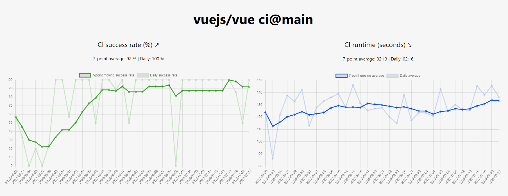

# gha-stats-next

### Visualized statistics of GitHub Actions CI

Try it at: https://honeypotio.github.io/gha-stats-next/

[Fork me!](https://github.com/honeypotio/gha-stats-next/fork)



## Usage

```bash
cp .env.local.example .env.local
yarn install
yarn dev
```

## Deployment

The data is exported into a static page nightly and deployed to GitHub Pages (needs to be enabled in repo settings).

Use the `CONFIG` repository secret to specify repos and workflows to display. See example in [`.env.local.example`](https://github.com/honeypotio/gha-stats-next/blob/main/.env.local.example)
